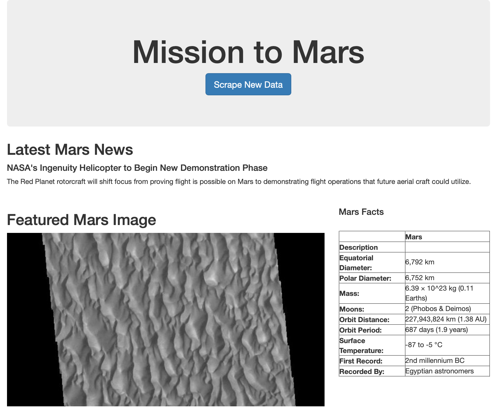
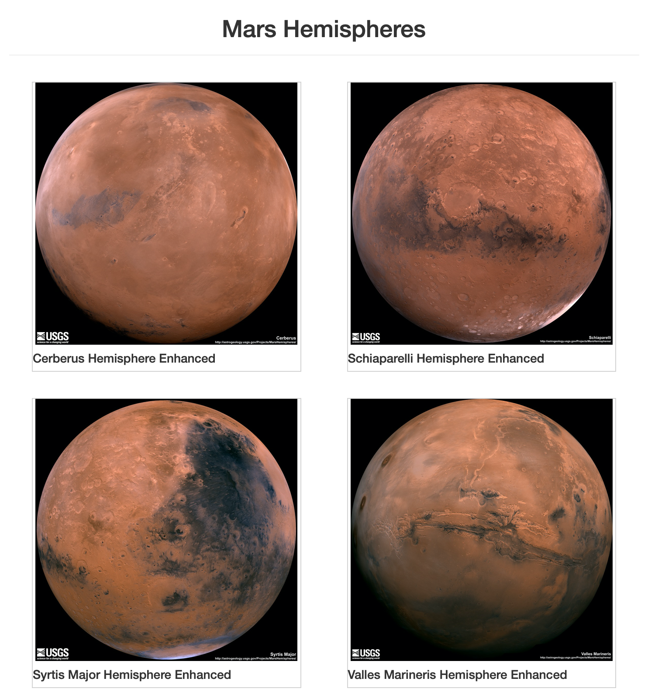

# Web Scraping - Mission to Mars

## Introduction
The purpose of this challenge is to build a web application that scrapes various websites for data related to the Mission to Mars and displays the information in a single HTML page.

## Web Scraping
Complete web scraping using Jupyter Notebook, BeautifulSoup, Pandas, and Requests/Splinter using Jupyter notebook.

### NASA Mars News
* Scrape the [NASA Mars News Site](https://mars.nasa.gov/news/) and collect the latest News Title and Paragraph Text.

### JPL Mars Space Images
* Scrape the JPL Featured Space Image via  [website](https://data-class-jpl-space.s3.amazonaws.com/JPL_Space/index.html).

### Mars Facts
* Visit the [Mars Facts webpage](https://space-facts.com/mars/) and use Pandas to scrape the table containing facts about the planet including Diameter, Mass, etc.
* Use Pandas to convert the data to a HTML table string.

### Mars Hemispheres
* Visit the [USGS Astrogeology site](https://astrogeology.usgs.gov/search/results?q=hemisphere+enhanced&k1=target&v1=Mars) to obtain high resolution images for each of Mar's hemispheres.

## MongoDB and Flask Application
Use MongoDB with Flask templating to create a new HTML page that displays all of the information that was scraped from the URLs above.

## Tools
* Python
* Jupyter Notebook
* BeautifulSoup
* Pandas
* Requests/Splinter
* MongoDB
* Flask

## Copyright

Trilogy Education Services © 2021. All Rights Reserved.
